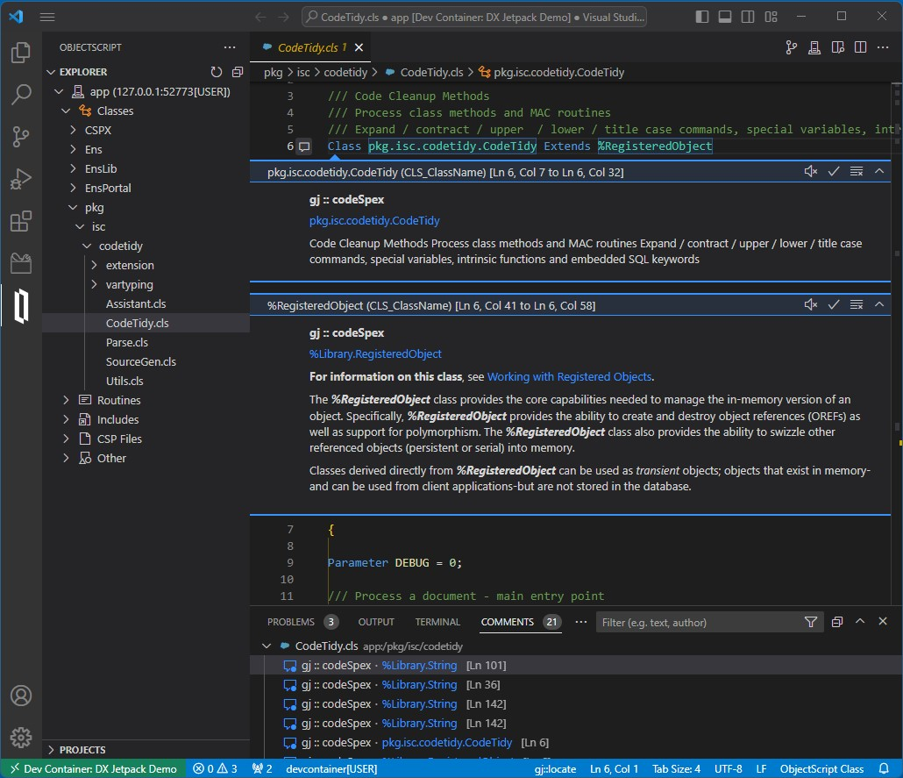
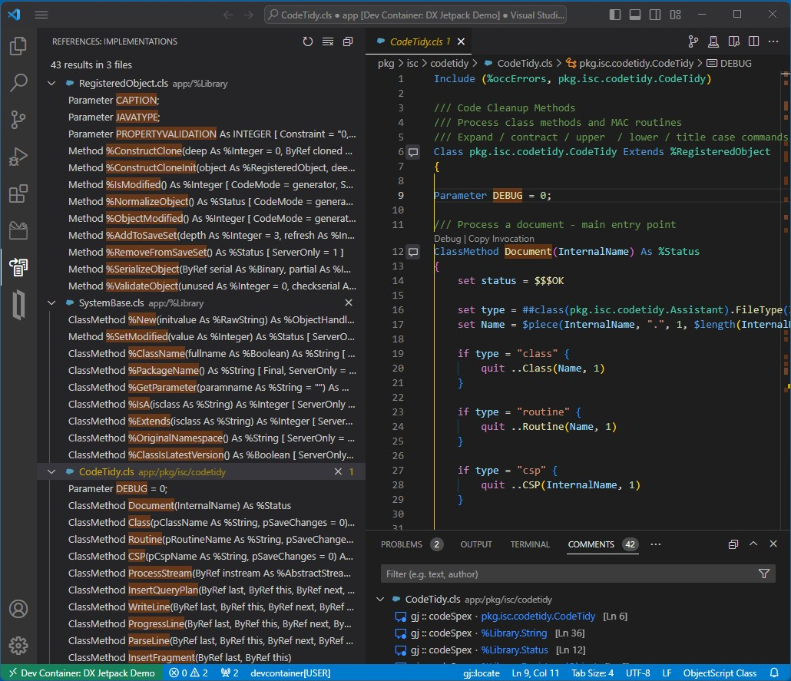
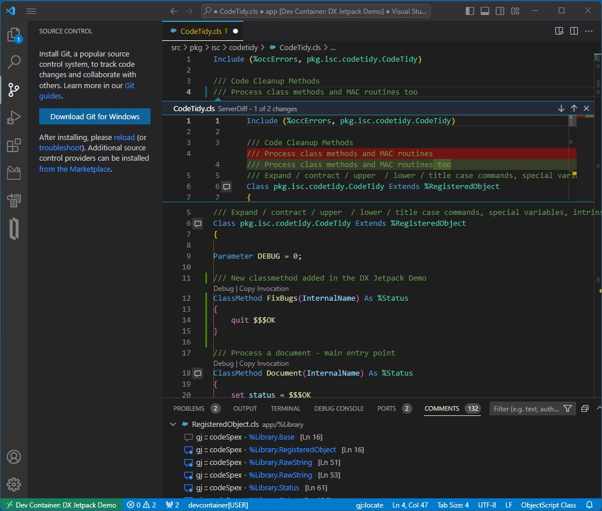

# Demo of InterSystems DX Jetpack for VS Code

Try the [DX Jetpack](https://openexchange.intersystems.com/package/DX-Jetpack-for-VS-Code) in VS Code using a dev container. In the dev container is an InterSystems IRIS Community environment augmented with InterSystems Package Manager (IPM) and the [isc-codetidy](https://openexchange.intersystems.com/package/isc-codetidy) package.

## About DX Jetpack
Curated by [George James Software](https://georgejames.com), this extension pack boosts the developer experience (DX) for devs working on [InterSystems](https://developer.intersystems.com) platforms.

We entered the DX Jetpack into the 2023 [InterSystems Developer Tools Contest](https://openexchange.intersystems.com/contest/30). If you like it please vote for it.

See all our VS Code extensions in [Visual Studio Marketplace](https://marketplace.visualstudio.com/publishers/georgejames).

## Launching the Demo

You can either run the demo dev container locally (Docker Desktop is a prerequisite), or if your GitHub account lets you use [Codespaces](https://docs.github.com/codespaces) you can run it remotely.

### Locally in VS Code Desktop
1. Clone the repo from https://github.com/gjsjohnmurray/dx-jetpack-demo
2. Open the locally-cloned folder in VS Code. If asked to trust the folder, agree.
3. When a notification appears in the bottom right, choose 'Reopen in Container'. If you don't see that notification, try clicking on the bell icon on the far right of the status bar. If that doesn't help, click the green `><` at the left end of the status bar, then select `Reopen in Container` from the `Dev Containers` section.
4. When the container starts to build you may optionally like to click on the notification and watch the progress messages.
5. When this procedure completes, skip the Codespaces section below and proceed to "Using the Demo".

### Remotely on GitHub Codespaces
There's no need to clone https://github.com/gjsjohnmurray/dx-jetpack-demo. Simply go to the Codespaces tab on the dropdown from the green "<> Code" button on that repo's "Code" tab, then opt to "Create codespace on main".

## Using the Demo

The first time VS Code connects to the dev container it will install the DX Jetpack and its dependencies. Notice the 'clock' badge on the Extensions icon in the Activity Bar.

> The ServerDiff extension will ask for permission to reinstall itself in order to use the `quickDiff` API proposal that it relies on. Click 'Yes'. After a reload it will then direct you to a section in its README telling you how to allow its use of proposed API. Skipping this will mean you can't try the features of ServerDiff.

Once the extensions have installed, check the ObjectScript panel on the status bar. It should show `devcontainer[USER]`, indicating a connection to the USER namespace of the InterSystems IRIS environment inside the container. If necessary, click on that panel and choose `Refresh Connection` from the quickpick that appears at the top of the window.

From the Activity Bar use the ObjectScript Explorer or the Server Manager to explore the `pkg.isc.codetidy.*` classes that isc-codetidy added to the USER namespace. We suggest you focus on the three new extensions we created specifically for the contest:

- [gj :: codeSpex](https://marketplace.visualstudio.com/items?itemName=georgejames.codespex)
- [ObjectScript Class View](https://marketplace.visualstudio.com/items?itemName=georgejames.objectscript-class-view)
- [ServerDiff](https://marketplace.visualstudio.com/items?itemName=georgejames.intersystems-serverdiff)

Here are some ideas, but feel free to go 'off-piste' and do whatever you like. The dev container can easily be rebuilt so you can start again.

1. Open a class from the `pkg.isc.codetidy` package, for example `pkg/isc/codetidy/CodeTidy.cls`.
2. Notice the 'speech bubble' icons that appear in the editor gutter, and the corresponding rows in a new COMMENTS tab in the Panel and the bottom of the window. Click to explore what they reveal.

**gj :: codeSpex** has given you a new way of reading the documentation for classes referenced in a line, which you would otherwise only see by hovering.

Using buttons on the title bar you can:
- Mute an entry so it doesn't show again during this session.
- Resolve it. This changes its status, giving it a different icon in the Comments panel. The filter button in that panel can be used to hide Resolved items.
- Resolve all occurrences in all currently-open documents by using a key modifier when clicking (see the button's hover tip).
- Exclude this from future scanning anywhere in this workspace, or for any workspace. _[TODO: These features are not yet implemented]_
- Collapse an entry.

3. From the context menu anywhere in the class, choose `Find All Implementations`. The References view will appear:

**ObjectScript Class View** has provided this information, which shows you all the class members your class defines or inherits, grouping them under the class where they are implemented.

4. Open a class for editing outside the USER namespace. To do this, first use the `Export` option on its context menu in the ObjectScript Explorer tree. This creates a copy of the class definition in a file under the `src` folder of the folder open in VS Code. In the ObjectScript Explorer tree the class acquires an icon, and by clicking on the item you will open the exported copy.

Make some changes but don't save them yet. In the screenshot below we modified the comment on line 4 and added a new `FixBugs` classmethod around line 12.

**ServerDiff** has added diff markers in the gutter. The blue marker denotes a changes, the green one shows insertions. In the screenshot we have clicked the line 4 marker to see details.

Notice how the Source Control view shows that Git is not even installed in the dev container.

As soon as you save the changes the updated class gets imported into the namespace, causing the diff markers to disappear. If you disable automatic import on save by changing the `objectscript.importOnSave` setting you can save changes incrementally without losing the indication of differences relative to the version of the class in the namespace.

## About George James Software

Known for our expertise in InterSystems technologies, George James Software has been providing innovative software solutions for over 35 years. We focus on activities that can help our customers with the support and maintenance of their systems and applications. Our activities include consulting, training, support, and developer tools - with the Serenji debugger and Deltanji source control being our flagship tools. These tools augment InterSystems' technology and can help customers with the maintainability and supportability of their applications over the long term. 

To find out more, go to our website - [georgejames.com](https://georgejames.com) 

